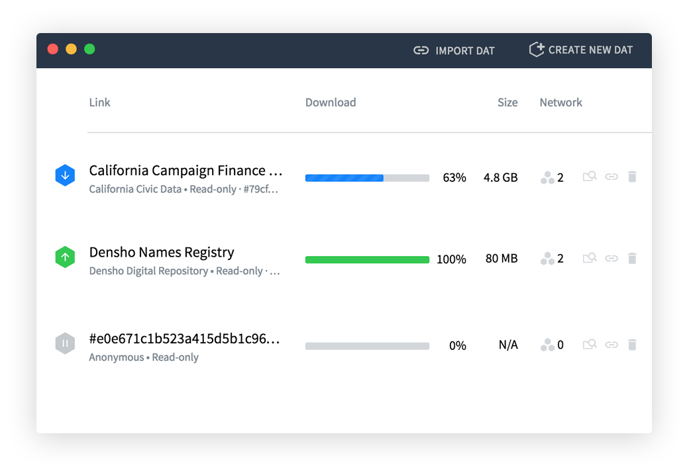

# Dat Desktop

**Peer to peer data sharing app built for humans.**

[](https://travis-ci.org/dat-land/dat-desktop) 
[](https://standardjs.com)



## Table of Content

- [Download](#download)
- [Commands](#commands)
- [FAQ](#faq)
- [License](#license)

## Download

_Dat_ needs to be installed first. To run the app locally check out our [download
guide](https://datproject.org/install) or install directly from the command line:

```sh
npm install -g dat
```

## Commands

To run _Dat Desktop_ in development mode:

```sh
npm install             # install dependencies
npm start               # start the application
```

To create binary packages run:

```sh
npm install             # install dependencies
npm run dist :os        # compile the app into an binary package
```

## FAQ

### How to speed up downloading Electron

If you’re not in Europe or the US, you might want to use a different mirror for 
`electron`. You can set the `ELECTRON_MIRROR` variable to point to a different 
provider:

```sh
# Europe / US
$ npm install

# Asia / Oceania
$ ELECTRON_MIRROR="https://npm.taobao.org/mirrors/electron/" npm install
```

## Licenses

[MIT License](./LICENSE)

### Font Attribution & License

SourceSansPro-Regular.ttf: Copyright 2010, 2012 Adobe Systems Incorporated (http://www.adobe.com/), with Reserved Font Name 'Source'. All Rights Reserved. Source is a trademark of Adobe Systems Incorporated in the United States and/or other countries. [SIL Open Font License, 1.1](http://scripts.sil.org/cms/scripts/page.php?site_id=nrsi&id=OFL)

SourceCodePro-Regular.ttf: Copyright 2010, 2012 Adobe Systems Incorporated. All Rights Reserved. [SIL Open Font License, 1.1](http://scripts.sil.org/cms/scripts/page.php?site_id=nrsi&id=OFL)
