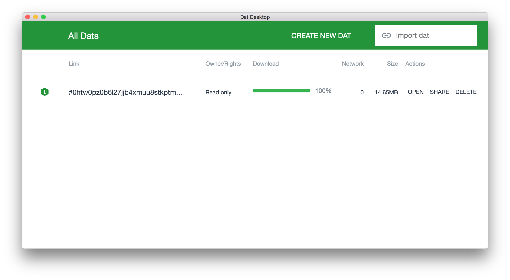

# dat-desktop

WIP desktop app for [dat](https://github.com/maxogden/dat).



[](https://travis-ci.org/juliangruber/dat-desktop)

## Running

```bash
$ npm install
$ npm run rebuild
$ npm start
```

## Build assets

```bash
$ npm run bundle            # build JS
$ npm run watch             # watch and rebuild JS
```

Then drop files onto the app window and watch the console.

## CLI

-- `--data=DIR` overwrite the data path

## Directory structure

```txt
elements/      standalone application-specific elements
lib/           generalized components, should be moved out of project later
models/        choo models
pages/         views that are directly mounted on the router
app.js         client side application entry
index.js       electron application entry
scripts/       various scripts used to build and manage the repository
```

## FAQ
### How can I speed up downloading Electron?
If you're Europe / US you might want to use a different mirror for `electron`.
You can set the `ELECTRON_MIRROR` variable to point to a different provider:
```sh
# Europe / US
$ npm install

# Asia / Oceania
$ ELECTRON_MIRROR="https://npm.taobao.org/mirrors/electron/" npm install
```

## License

  MIT
