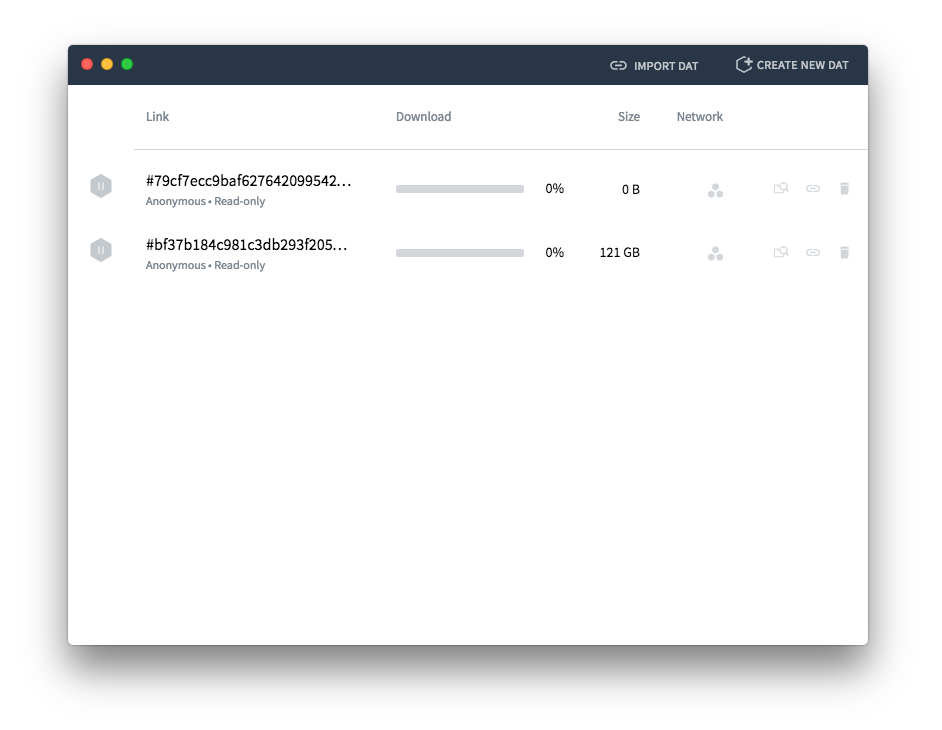

# dat-desktop

WIP desktop app for [dat](https://github.com/maxogden/dat).



[](https://travis-ci.org/juliangruber/dat-desktop)

## Running

```bash
$ npm install
$ (cd app && npm install)
$ npm run rebuild
$ npm start
```

## Watch and compile SCSS

```bash
$ npm run watch-css
```

Then drop files onto the app window and watch the console.

## CLI

-- `--data=DIR` overwrite the data path

## Styles

For now, check out

- `lib/render.js` for html
- `/scss/main.scss` for scss

Styles are imported from https://github.com/datproject/design. All variables, mixins, and component styles are available in main.

There's also the html being generated by [hyperdrive-ui](https://github.com/karissa/hyperdrive-ui).

## Directory structure

```txt
elements/      standalone application-specific elements
lib/           generalized components, should be moved out of project later
models/        choo models
pages/         views that are directly mounted on the router
app.js         client side application entry
index.js       electron application entry
```

## License

  MIT
